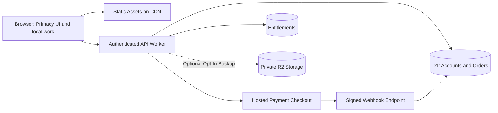

# Primacy: Naming, Rights, Payments And Launch Review

Reviewed 9 September 2026. This is an initial source-backed risk review and implementation proposal, not a trademark clearance, legal opinion, security audit, or guarantee of compliance. The working commercial assumption is an India-based seller; confirm the legal entity, customer countries and age range before onboarding payments.

## Recommended Product Position

**Primacy — Your Prioritization Instrument.** Keep Primacy as the working name while clearance is pending. It expresses precedence well. The descriptor should explain the job more precisely than “productivity” alone.

**Choose your priorities. Start with what matters.**

“Primacy is your personal prioritization instrument. List your tasks. Choose a framework. Decide what comes first.”

The user does the work. Primacy supplies structure for choosing the work. Do not imply task execution, automatic decisions, guaranteed productivity gains, or that all six frameworks have been clinically validated.

## Naming Architecture

| Layer | Recommended Language | Why |
|---|---|---|
| Masterbrand | Primacy | One stable identity; no competing PocketBook/executive sub-brands in the UI |
| Product descriptor | Your Prioritization Instrument | Explains the main job |
| Time perspectives | Daily, Weekly, Monthly, Yearly | Simple, stable navigation |
| Primary activity | Priorities | The central product purpose |
| Framework selector | Approach | Plain language, accompanied by a one-line explanation |
| Supporting surfaces | Notes, Habits, Reflection, Decisions, Progress | Describe the activity directly |
| Occasional actions | Tools | Consolidates secondary actions |
| Configuration | Settings | Familiar and discoverable |
| Commercial tier | Primacy Plus, or Primacy Lifetime | Clearer than an executive/patron hierarchy; commercial terms must define exactly what is included |

Possible alternate brand directions: **Firstwise** (choosing wisely), **Orderwell** (putting work in order), **Foremost** (what comes first). These are creative candidates, not checked or available names. No alternative is currently demonstrably safer than Primacy. Do not buy a domain or commission a new identity until a shortlist is screened.

A preliminary search found existing technology businesses using the Primacy name, including [Primacy's digital technology services](https://primacy.com/services/technology-services) and [Primacy Infotech's software business](https://www.primacyinfotech.com/about/index). This is a reason for proper screening, not a conclusion that your use infringes. Search exact and similar marks, relevant software/SaaS goods and services, unregistered commercial use, domains and app stores in launch markets. Use [IP India](https://search.ipindia.gov.in/) and the [USPTO clearance guidance](https://www.uspto.gov/trademarks/search/comprehensive-clearance-search-similar-trademarks); have a trademark professional interpret results. Class numbers alone do not resolve confusion.

## Priority Risks And Actions

### 1. Apple Device Artwork And Visual References

Apple's published third-party guidelines distinguish compatible-product references from endorsement. Its compatibility-imagery conditions specify an actual photograph of the genuine product, rather than an artist rendering. They also restrict imitation of distinctive Apple website design. The new generated and procedural MacBook Pro, iPad Pro and iPhone Pro concepts do not automatically satisfy those conditions. A disclaimer does not grant rights. [Apple guidelines](https://www.apple.com/legal/intellectual-property/guidelinesfor3rdparties.html)

Keep these assets as illustrative design-review concepts; before public marketing, obtain appropriate permission/licensed genuine-device photography or use original generic hardware designs that do not reproduce protected Apple features. Commission a distinct Primacy layout and motion language. Do not copy Apple screenshots, product photos, logos, icons, text or animation sequences into production. Final public artwork needs a rights decision even if the code itself is original. Private review status limits audience; it is not legal clearance.

### 2. Framework Names And Explanations

The implementation offers Top 3, Ivy Lee Method, Eisenhower Matrix, MoSCoW Method, 1–3–5 and Pareto 80/20. Do not describe this list as “100% public domain” or “zero infringement.” Under US copyright principles, a method itself differs from its protected written or visual explanation; names may raise separate trademark issues. This does not determine the result under every jurisdiction. Write original explanations and layouts, avoid copying commercial books/courses, and assess name usage independently. [US Copyright Office](https://www.copyright.gov/help/faq/faq-protect.html)

For MoSCoW, the Agile Business Consortium publishes the technique as Must Have, Should Have, Could Have and Won't Have this time. Link the source for learning, but do not reproduce its branded diagrams, handbook text, certification marks or imply accreditation. [Consortium explanation](https://www.agilebusiness.org/resource/what-is-moscow-prioritization/)

A conservative interface can use descriptive labels with attributed method references in help: Top 3, Ordered Six, Urgent / Important, Must / Should / Could / Later, 1–3–5, Impact 80/20. Such labels improve clarity but are not a substitute for rights review. Preserve internal stored IDs during any label change.

### 3. Research And Performance Claims

The landing links primary research on attention residue, implementation intentions and habit repetition. Those studies inform design principles; they do not establish that Primacy or every framework improves a user's productivity. Avoid universal outcome promises, invented statistics and guaranteed timelines. Keep a visible statement that the product has not been independently evaluated. The previous sub-millisecond search and general biometric/encrypted-local-storage claims were removed from the upgrade modal because the source did not substantiate them.

### 4. Privacy And Security: Concrete Source Findings

- Work is saved in localStorage as JSON, without general encryption at rest. Passphrase-protected exports are a separate capability. A visual shutter is not account authentication or encryption.
- The biometric helper contains simulated success and fallback success paths. It is not a production passkey system. Before presenting it as security, implement registration, stored public keys, server-side challenge/origin/RP checks, assertion verification and a recovery flow; fail closed on cancellation/failure.
- The license helper accepts bundled promotional keys and a character checksum. This is demo activation, not cryptographic license verification or evidence of payment. Keep real checkout disabled until entitlement handling exists.
- The telemetry SDK previously collected interaction events and queued them locally. It is now **disabled by default** behind `VITE_ENABLE_TELEMETRY=true`; do not enable it without a defined data inventory, lawful basis/consent where applicable, retention and deletion controls.
- The separate Node analytics server has a default owner-secret fallback and supports credentials in query strings. Do not expose that server as a production backend. Replace defaults with required secrets, remove query-token authentication, add authorization, rate limiting and access logging that never records secrets.
- Google Fonts requests were removed from the entry page; the interface uses the available system font stack.

These findings were read in `src/utils/cryptoVault.js`, `src/utils/licenseManager.js`, `src/utils/telemetry.js`, `src/hooks/useJournalStorage.js` and `server/src/server.js`. The privacy/security components need dedicated adversarial testing before a commercial release.

India's final DPDP Rules and enforcement timeline are published by MeitY. Determine which provisions are in force at launch and applicable to your processing; do not treat the old draft as current law. Design understandable notices, consent withdrawal where relevant, data access/erasure handling, grievance contact, breach response, retention and processor agreements. If serving children or overseas users, scope the additional obligations with counsel. [MeitY final rules and timeline](https://www.meity.gov.in/documents/act-and-policies/digital-personal-data-protection-rules-2025-gDOxUjMtQWa?pageTitle=Digital-Personal-Data-Protection-Rules-2025)

### 5. Code, Fonts And Generated Assets

The installed direct runtime packages report: React 18.3.1 (MIT), React DOM 18.3.1 (MIT), Three.js 0.180.0 (MIT), jsPDF 4.2.1 (MIT), Lucide React 0.475.0 (ISC), and canvas-confetti 1.9.4 (ISC). Preserve their notices and audit transitive packages and any separately sourced art/fonts before shipping. This direct-package list is not a complete SBOM or vulnerability review. Do not assume use of an AI/design tool clears third-party artwork or grants exclusivity.

The two new raster assets were made with the built-in image generator; originals are retained. They are **1536 × 1024**, not native 4K/8K. The WebGL pages use 2048 × 2560 textures; device screen textures reach 3072 × 1920. Visual quality improved, but this is still a procedural interactive prototype with generated studio images, not an Apple CAD or offline path-traced cinematic production. A final premium campaign should commission high-resolution original 3D source models, approved textures, lighting scenes, motion masters and licensed final stills. The old unselected render files should undergo provenance review before reuse.

### 6. Commercial Terms

Before charging, define the seller, support contact, total payable price/tax treatment, refund policy, delivery/activation process and consumer terms. “Lifetime” must specify the licensed product/version, updates, device rights, support period, transfer rules and what happens if a hosted service closes. Do not promise lifetime hosted sync at a one-time price without modeling recurring operating costs. Have an Indian accountant review GST, invoicing, export receipts and other obligations for the actual seller structure; a merchant of record does not remove the seller's own income-tax/company obligations.

## Recommended Deployment And Payment Architecture

**Prototype:** keep the current static local app and no-charge activation demo. The current Sites connection cannot access the project recorded in `.openai/hosting.json`; the connector returned “project not found,” and the owned-site inventory contained no Primacy project. Reconnect the account/workspace that owns the existing project, or explicitly choose a new project. No unrelated site's deployment was modified.

**Production recommendation:** Cloudflare Workers with Static Assets for the frontend and a small API Worker, D1 for accounts/orders/entitlements/webhook receipts, and R2 only when private backup or file storage is needed. This matches the current React/Vite app without requiring a framework rewrite. Cloudflare documents combined static assets and Worker logic, with D1/R2 for application data and files. [Workers Static Assets](https://developers.cloudflare.com/workers/static-assets/), [web-app architecture patterns](https://developers.cloudflare.com/use-cases/web-apps/)

Keep personal task content out of the payment backend. Provide a local-first mode with export/recovery before adding sync. If sync is added, specify schema versioning, offline queues, per-user authorization, conflict resolution, deletion, backup retention and recovery. Encryption at rest is different from end-to-end encryption; make a deliberate choice and match claims to the design.

| Option | Best Fit | Decision |
|---|---|---|
| Razorpay | India-first sales needing UPI/cards | First candidate for an Indian seller; onboarding and international-method approval are separate checks |
| Paddle | Global software sales with a merchant of record | Evaluate if tax collection/remittance and billing operations outweigh higher fees; verify seller/product acceptance |
| Stripe | Flexible direct payment processing | Use if an account is already approved or invitation is obtained; do not assume instant onboarding in India |

Razorpay supports Indian local payment methods and documents activation for international methods. [Razorpay international/local payments](https://razorpay.com/docs/payments/international-payments/?preferred-country=IN)

Paddle acts as seller of record for covered transactions and handles applicable transaction sales taxes; verify contract scope and eligibility. [Paddle's tax role](https://www.paddle.com/help/sell/tax/how-paddle-handles-vat-on-your-behalf)

Stripe currently describes India service as invite-only for new accounts, so it should not be the sole unconfirmed launch dependency. [Stripe India availability](https://support.stripe.com/questions/stripe-accounts-are-invite-only-in-india?locale=en-GB)

### Payment Flow To Implement

1. Create an order on the server from an allowlisted product/price; never trust a client-supplied price or license flag.
2. Open the provider's hosted checkout. Keep API secrets and card data out of Primacy's frontend.
3. Verify payment on the server. The return page is only a user experience signal, not proof of payment.
4. Validate webhook signatures against the raw request bytes. Store the unique event ID and process idempotently, tolerating duplicates and out-of-order delivery.
5. Verify the order, currency, amount and captured/paid status before issuing the entitlement. Handle refunds, disputes and revocation/reconciliation.
6. Associate access with a recoverable account. For offline usage, optionally issue an expiring signed entitlement verified with a public key; remove checksum-based demo licensing from production.
7. Test abandoned checkout, late payment, duplicate events, tampered signatures, mismatched amounts, refunds, account recovery and support workflows before enabling live mode.

Razorpay explicitly distinguishes client callbacks from asynchronous server webhooks, and documents signature validation, duplicate IDs and out-of-order events. [Webhook flow](https://razorpay.com/docs/webhooks/), [validation and idempotency](https://razorpay.com/docs/webhooks/validate-test/?locale=en-US)

### Release Order

1. Finish prototype review and reconnect the intended deployment account.
2. Clear name/artwork and approve the final production claim set.
3. Implement secure accounts, entitlements and verified test-mode payments.
4. Add backups/recovery and validate local data migration.
5. Publish privacy/terms/refund/support pages; confirm business and payment-provider onboarding.
6. Run accessibility, security, performance and payment failure-path testing.
7. Enable real payments in a controlled release, then measure whether users can choose priorities more easily.

**Data migration:** local browser storage is origin-specific. A deployed HTTPS domain cannot automatically read the user's work on `127.0.0.1:3000`. Export from the local app and import on the deployed domain; do not interpret an empty hosted workspace as deleted local data.
