# PocketBook: Single-Page Marketing Website & Brand Design Specification
**Prepared by the Website Development Pod & Creative Direction Team**  
**Classification:** Technical & Visual Architecture Specification  
**Status:** Live & Deployed (`?view=landing`)  

---

## 1. Executive Summary & Design Manifesto

The PocketBook Single-Page Marketing Website is designed as a digital showroom for the **Anti-SaaS Luxury Stationery Movement**. It bridges the tactile mindfulness of Japanese and European paper craft with the performance, privacy, and speed of modern local-first web architecture.

### Core Visual Principles
1. **Universal Swiss Typography (Strict Rule 1 Compliance):** Exclusively styled using clean neo-grotesque Helvetica / Inter sans-serif typography. Zero monospace, zero decorative fonts.
2. **24px Universal Grid Cadence (Strict Rule 6 Compliance):** All vertical spacing, padding, margins, and component heights adhere strictly to multiples of 24px (24px, 48px, 72px, 96px).
3. **Intentional Chromatic Discipline (Strict Rule 3 Compliance):** A calm, distraction-free black, warm gray, and white foundation with accents strictly reserved for the 3 progress states:
   - `progress-ink-green` (Bamboo Green): Conquered outcomes & positive ROI
   - `progress-ink-yellow` (Amber Yellow): Momentum & active focus
   - `progress-ink-red` (Vermilion Red): Uncompleted tasks & SaaS subscription drain
4. **Seamless Dual-View Architecture:** The website is not an isolated brochure; it is directly coupled with the live journal workspace. Visitors can test the tool interactively on the landing page or jump straight into the full journal workspace with zero sign-up friction.

---

## 2. Component Architecture & Interactive Widgets

```mermaid
graph TD
    App[App.jsx Route Controller] -->|view === 'landing'| MLP[MarketingLandingPage.jsx]
    App -->|view === 'daily'| MainJournal[Live Journal Workspace]

    subgraph MarketingLandingPage
        Nav[1. Sticky Top Navigation Bar]
        Hero[2. Hero Section + 3D Interactive Notebook Canvas]
        Manifesto[3. The Anti-SaaS Manifesto Contrast Grid]
        FwSuite[4. Interactive 9 Frameworks Showcase]
        Studio[5. Interactive Archival Ink & Paper Studio]
        Calc[6. Live Interactive SaaS Savings Calculator]
        Vault[7. Archival Vault & Typeset Print Engine]
        Pricing[8. Transparent Two-Tier Pricing Table]
        Footer[9. Heirloom Brand Footer]
    end

    Nav -->|Launch Journal| MainJournal
    Hero -->|Try PocketBook Free| MainJournal
    FwSuite -->|Apply Model in Journal| MainJournal
    Pricing -->|Start Free| MainJournal
    Pricing -->|Patron $24| PUM[PatronUpgradeModal.jsx]
```

---

## 3. Detailed Section-by-Section Breakdown

### Section 1: Sticky Top Navigation Bar (`h-14`)
- **Brand Mark:** Authentic woven fabric label monogram with `POCKETBOOK` letterspaced in bold Helvetica (`tracking-[0.25em]`).
- **Sub-Brand Descriptor:** *"Heirloom Stationery Laboratory"* displayed in quiet uppercase tracking.
- **Anchor Links:** Smooth scrolling to `#manifesto`, `#frameworks`, `#studio`, `#calculator`, and `#pricing`.
- **Global Actions:**
  - Dark / Light Mode Toggle: Seamless SVG Sun/Moon transition synchronized with `localStorage`.
  - Lifetime Patron Pill: Direct modal trigger to `$24` activation dialog.
  - Primary Action Button: `[ Launch Journal → ]` switches directly to `activeView = 'daily'`.

### Section 2: Hero Section & Interactive 3D Notebook Canvas
- **Positioning Statement:**
  > *"Own Your Mind. Own Your Journal."*  
  > *"The digital heirloom notebook engineered for deep executive focus. Zero monthly subscriptions, zero cloud servers, and 100% offline private local storage."*
- **Primary Dual CTAs:**
  - `[ Try PocketBook Free ]`: Instant 1-click launch into the interactive journal.
  - `[ Get Lifetime Patron — $24 ]`: Frictionless checkout simulation & key activation.
- **Interactive Miniature Notebook Preview:**
  - Authentic 24px dot-grid coordinate paper sheet.
  - Center silk ribbon bookmark with click-to-rustle audio.
  - Interactive Monogram Seal: 1-click toggling between **24K Gold Foil** and **Blind Deboss**.
  - Interactive Task Toggles: Visitors can click the sample "Top 3" tasks to trigger authentic check sounds and see bamboo green ink applied in real time.

### Section 3: The Anti-SaaS Manifesto Section
- **Contrast Grid (The Bloated SaaS Bureaucracy vs The PocketBook Sanctuary):**
  - Highlights the psychological toll of 400-task backlogs vs the 24px single-page daily constraint.
  - Contrasts \$15–\$25/month perpetual subscription fees against \$24 lifetime ownership.
  - Contrasts cloud corporate surveillance and AI training models against 100% private client-side IndexedDB storage.

### Section 4: Interactive 9 Productivity Models Sandbox
- Tabbed selector showcasing all 9 public-domain frameworks:
  - **Focus Cluster:** Top 3 (Rule of 3), Ivy Lee Method (6 sequential priorities), Eat That Frog (morning conqueror).
  - **Decision Cluster:** Eisenhower Matrix (4 quadrants), MoSCoW Method (agile triage), ABCDE Method (consequence grading).
  - **Capacity Cluster:** The 1-3-5 Rule, Pareto 80/20, Buffett 5/25 Avoid-at-all-costs list.
- Dynamic scenario card updating description, recommended use-case, and a direct `Apply in Live Journal` link for each selected model.

### Section 5: Interactive Archival Ink & Paper Studio
- **Ink Palette Switcher:**
  - Carbon Black (`#18181B`)
  - Diamine Oxblood (`#5C1414`)
  - Iroshizuku Kon-peki Cerulean (`#0369A1`)
  - Sepia Walnut (`#78350F`)
- **Paper Tone Switcher:**
  - Crisp White (`#FFFFFF`)
  - Warm Italian Vellum (`#FAF7EE`)
  - Japanese Washi Grain (`#F2F1ED`)
- **Live Sample Rendering Sheet:** Displays typography dynamically recolored in the selected ink and resting on the selected archival paper tone with 24px grid coordinate dots.

### Section 6: Live Anti-SaaS Subscription Savings Calculator
- Real-time mathematical financial calculator:
  - Tool options: Notion (\$12/mo), Todoist (\$5/mo), Day One (\$4/mo), Superhuman (\$30/mo).
  - Dynamic Calculations:
    - `Monthly SaaS Drain = Sum(Active Tools)`
    - `1-Year SaaS Cost = Monthly × 12`
    - `3-Year SaaS Cost = Monthly × 36`
    - `3-Year Net Savings = 3-Year SaaS Cost - $24`
  - Demonstrates that PocketBook Lifetime Patron pays for itself in ~36 days.

### Section 7: Archival Vault & Typeset Print Engine
- **Obsidian & Notion Markdown Vault:** Structured frontmatter export preview.
- **Typeset Annual Print Engine:** Editorial bound book PDF preview for physical bookbinding.

### Section 8: Transparent Two-Tier Pricing Table
- **Universal Free (\$0 Forever):** All 9 models, 2-second morning alignment, rapid daily stream, habits, evening reflection, keyboard shortcuts, silk ribbon bookmark, and local JSON backup.
- **Lifetime Patron (\$24 Once):** Foundational stationery craft unlocked: all archival inks, Italian warm vellum, Washi paper, Markdown vault export, typeset annual print engine, gold foil monogramming, and 12 bespoke Japanese woodblock chapter spreads.

---

## 4. Quality Control & Performance Metrics

| Quality Dimension | Standard Enforced | Status |
| :--- | :--- | :--- |
| **Typography Rule** | Zero `font-mono` (Rule 1) | **100% Passed** |
| **Grid Cadence** | Strict 24px Universal Rhythm (Rule 6) | **100% Passed** |
| **Color System** | 3-Color Dynamic Progress Ink (Rule 3) | **100% Passed** |
| **Brand Purity** | Zero Prohibited Brand Names (Rule 17) | **100% Passed** |
| **Zero-Scroll Viewport** | Preserved in Journal Mode (Rule 4) | **100% Passed** |
| **Production Build** | Vite production compilation | **Passed in 938ms** |

---

## 5. How to Access and Test

- **URL Parameter Access:** Navigate to `http://localhost:3000/?view=landing` to open the marketing website directly.
- **In-App Navigation:**
  - Click the **"Tour"** compass button in the top header toolbar to view the website.
  - Or open **Menu** $\rightarrow$ click **"Tour"** in the methodology section.
- **Return to Journal:** Click any of the **"Try PocketBook Free"** or **"Launch Journal"** buttons to return instantaneously to the live journal workspace.
